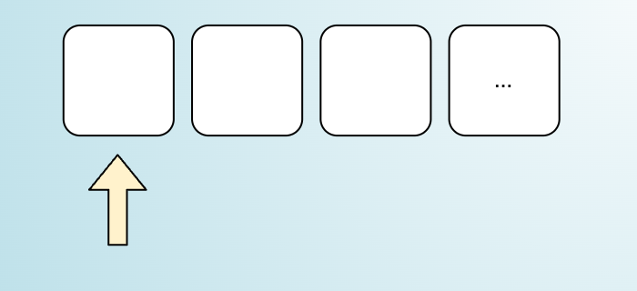
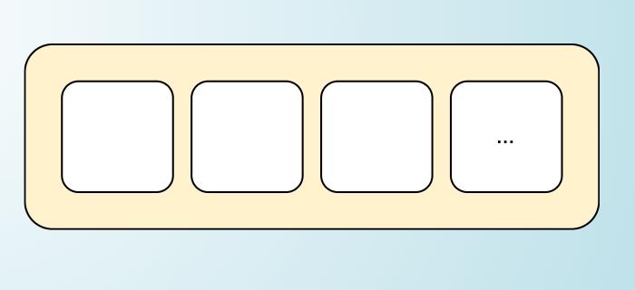

# 03 - Iterator Protocol

Before continuing let's try to distinguish between **iterator** and **iterable**. Those two concepts have very similar names and sometimes they are used interchangeably.

In JavaScript is important to understand the difference to appreacite the iteration protocols we are about to discuss.

## Iterator



An **iterator** is an object that acts like a cursoe to iterate over blocks of data sequentially.

The iterator itself doesn't know much about the collection, it just knows how to move to the next element.


## Iterable



An **iterable** is an object that contains data that can be iterated over sequentially.

It's a higher level concept. You can consider an iterable as a generic collection of items. If you want to go through all the items in order, **the iterable can give you an iterator** to do that.

If you want a simple and easy definition, an iterable is a collection, an iterator is a cursor over that collection.


## Iterator protocol in JavaScript

In JavaScript, an object is considered **an iterator** if it has a `next()` method. Every time you call it, it returns an object with the keys `done` (boolean) and `value`.

Sounds familiar, right?

> ℹ️  **Note:** this protocol is implicit, in fact, we don't have to explicitly tell JavaScript that the object implements some sort of iterator interface. This is an application of **duck typing** ([_"If it looks like a duck, swims like a duck, and quacks like a duck, then it probably is a duck"_](https://en.wikipedia.org/wiki/Duck_test) 🦆). This means that if an iterator behaves like an iterator than it can be considered an iterator.

Ok, let's see an example. Let's say we want to implement a generic _countdown_ utility that gives us all the numbers from a positive `n` to 0:

```js
// countdown.js
function createCountdown (start) {
  let nextVal = start
  return {
    next () {
      if (nextVal < 0) {
        return { done: true }
      }
      return {
        done: false,
        value: nextVal--
      }
    }
  }
}

const countdown = createCountdown(3)
console.log(countdown.next())
console.log(countdown.next())
console.log(countdown.next())
console.log(countdown.next())
console.log(countdown.next())
```

This example will print:

```plain
{ done: false, value: 3 }
{ done: false, value: 2 }
{ done: false, value: 1 }
{ done: false, value: 0 }
{ done: true }
```

TODO from here


That's all for now, congratulations on finishing the third chapter! 🎉

Take a little break and get ready to move to the [Next section](/04-iterable-protocol/README.md).

---

| [⬅️ 02 - Generators](/02-generators/README.md) | [🏠](/README.md)| [04 - Iterable protocol ➡️](/04-iterable-protocol/README.md)|
|:--------------|:------:|------------------------------------------------:|