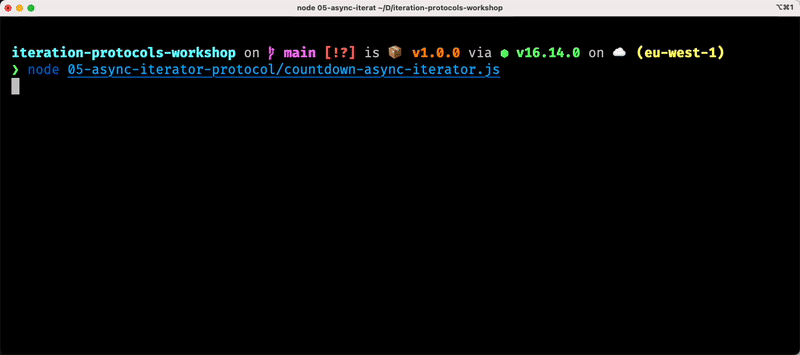

# 05 - Async Iterator Protocol

Everything we have discussed so far is **synchronous**.

This means that we can use the iterator and the iterable protocols and the techniques that we learned so far to iterate over data that is already available in memory or that it can be _produced_ synchronously.

This is great, but more often than not, JavaScript code tends to be **asynchronous**. In fact, most of the time, our code needs to use data from files, network sockets, HTTP servers (APIs), databases, etc.

Can we apply the same principles that we learned so far in **a**synchronous situations?

What if we could define asynchronous iterators (and iterable objects) to implement sequential iteration patterns with data arriving in order over time?

Great use cases would be traversing paginated datasets or consuming tasks from a remote queue.

But let's focus more on the **paginated dataset** example for now.

We need to consume a significant amount of data, so that data is exposed to us in chunks (pages). Every page contains a portion of the whole dataset and we need to explicitly request the next page to keep going.

Traversing a paginated dataset generally looks like this:

  1. Get the first page
  2. Use the data from the first page
  3. Request the next page
  4. Use the data from the next page
  5. ... repeat from **3.** until there are no more pages left

Do you recall this pattern from dealing with databases and APIs?

Wouldn't it be nice if we could handle this kind of situations by doing something like this? 👇

```js
for (const currentPage of somePaginatedDataset) {
  // process data from `currentPage`
}
```

Well, yes, but this `for ... of` loop is synchronous! 🤔

We need an equivalent **a**synchronous version of this loop, something that can wait for data to be available asynchronously before triggering the next iteration.

It turns out that what we want actually exists and it's called [`for await ... of`](https://developer.mozilla.org/en-US/docs/Web/JavaScript/Reference/Statements/for-await...of):

```js
for await (const currentPage of somePaginatedDataset) {
  // process data from `currentPage`
}
```

Note the use of `await` after `for`!

We can use this kind of syntax with **async iterables**, but before we get there, we need to learn about **async iterators**!


## The async iterator protocol

An object is an **async iterator** if it has a `next()` method. Every time you call it, it returns **a promise that resolves** to an object with the keys `done` (boolean) and `value`.

This is _quite similar_ to its synchronous counterpart!

The main difference here is that the `next()` method this time returns **a `Promise` object**!

The promise is used to capture the asynchronicity of the iterator. The returned promise indicates that data is being retrieved and that it will eventually be available. Once the promise is settled, the data is available and it is represented exactly as with synchronous iterators: an object with the shape `{ done, value }`.

So, let's see an example for an async iterator.

We could stick with our countdown example, except that this time we actually want some time to pass between one item and the next are emitted:

```js
// countdown-async-iterator.js
import { setTimeout } from 'timers/promises'

function createAsyncCountdown (from, delay = 1000) {
  let nextVal = from
  return {
    async next () {
      await setTimeout(delay)
      if (nextVal < 0) {
        return { done: true }
      }

      return { done: false, value: nextVal-- }
    }
  }
}
```

A few things worth reviewing here:

  1. We are importing `setTimeout` from the core `timers/promises` module. This function is a _promisified_ version of the classic `setTimeout`. It allows us to create a promise that resolves after a given delay (specified in milliseconds).
  2. We define a factory function called `createAsyncCountdown`. This function receives the starting number and the delay between numbers (in milliseconds) as arguments.
  3. The factory function returns an anonymous object (our async iterator)
  4. The `next()` function has to return a `Promise` object. Here we are making the function `async` to do that for us! In fact, an async function always returns a promise under the hood. The promise resolves when a `return` statement is reached in the function body (and it resolves exactly to the value that is returned).
  5. Finally note how are we are _awaiting_ the promise returned by `setTimeout` to wait for a given amount of time before letting our function code continue.

I hope that all of that seems quite clear to you at this point!

So now, how do we use this factory function and the async iterator that it returns?

```js
const countdown = createAsyncCountdown(3)
console.log(await countdown.next())
console.log(await countdown.next())
console.log(await countdown.next())
console.log(await countdown.next())
console.log(await countdown.next())
```

Simply, we just call the `next()` method!

But remember that this time, for every call, we get back a promise, so we need to `await` that promise before making another call to `next()`!

We can see what will happen if we execute the script above with the following image:



Note how it takes roughly 1 second for an item to become available and be printed!

It's also worth mentioning that here we went for a factory function based approach, but we could have used a class as well!

> **🎭 PLAY**  
> Try to re-implement our async countdown using a class.

Now this doesn't look extremely useful, but imagine that you could implement an iterator that every time we call `next()` fetches data from some remote resource!


## Async iterators with generators

We saw how convenient generator functions are to create iterator and iterable objects.

Can we use them also for async iterators? 

YES we can! 💪

So, let's see how to rewrite our async countdown iterator using a generator:

```js
// countdown-async-iterator-generator.js
import { setTimeout } from 'timers/promises'

async function * createAsyncCountdown (start, delay = 1000) {
  for (let i = start; i >= 0; i--) {
    await setTimeout(delay)
    yield i
  }
}
```

Note how this function is both an `async` function but also a generator... do you see that asterisk?!

This kind of functions have 2 super powers: you can use both `yield` and `await` in their body! 🤯

  - `await` works like with any other async function and it allows you to await for promises to settle before continuing the execution of the code
  - `yield` works like with any other generator function and it allows you to _produce_ a value and suspend the execution until `next()` is called again on the underlying generator object.

A little spoiler, this function returns an object that is also an **async iterable**, but we'll talk more about that in the next chapter!


## Exercises

Ok, get ready because in this chapter we are going to have some serious piece of exercise... 😏


> **🏹 Exercise** ([rickmorty.js](/05-async-iterator-protocol/exercises/rickmorty.js))
>
> I hope you like Rick and Morty... because we have to implement an iterator that allows us to go through
> a paginated API that returns all Rick and Morty characters! Yes, there's [an API](https://rickandmortyapi.com) for that!
>
> Let's do this! 💪
>
> A skeleton of the file is available at `05-async-iterator-protocol/exercises/rickmorty.js`.
>
> You can edit the file and run an interactive test session to validate your implementation with:
>
> ```bash
> npm run ex -- 05-async-iterator-protocol/exercises/rickmorty.test.js
> ```
>
> If you really struggle with this, you can have a look at [`rickmorty.solution.js`](/05-async-iterator-protocol/exercises/rickmorty.solution.js) for a possible solution.


## Summary

That's what we learned in this chapter:

  - Async iterators are the asynchronous counterpart of iterators.
  - They are useful to iterate over data that becomes available asynchronously (e.g. coming from a database or a REST API).
  - A good example is a paginated API, we could build an async iterator that gives a new page for every iteration.
  - An object is async iterator if it has a `next()` method which returns a `Promise` that resolves to an object with the shape: `{done, value}`.
  - The only difference with the iterator protocol is that this time `next()` returns a promise.
  - When we call next we need make sure we `await` the returned promise.


That's all for now, congratulations on finishing the fifth chapter! 🎉

Take a little break and get ready to move to the [Next section](/06-async-iterable-protocol/README.md).

---

| [⬅️ 04 - Iterable protocol](/04-iterable-protocol/README.md) | [🏠](/README.md)| [06 - Async Iterable protocol ➡️](/06-async-iterable-protocol/README.md)|
|:--------------|:------:|------------------------------------------------:|