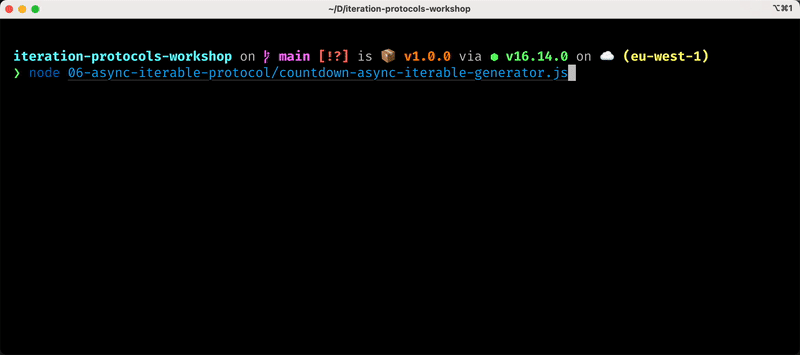

# 06 - Async Iterable Protocol

In the previous chapters we already mention that **async iterable** objects would allow us to do something like this:

```js
for await (const currentPage of somePaginatedDataset) {
  // process data from `currentPage`
}
```

Which is a very convenient way to implement an asynchronous iteration, like, for instance, going over a paginated dataset.

So, without further ado, let's see how we can create async iterables.


## The async iterable protocol

An object is an **async iterable** if it implements a special method called `Symbol.asyncIterator`, which is a zero-argument function that returns an **async iterator**.

Again this is very close to the definition of **iterable** objects that we discussed in [chapter 04](/04-iterable-protocol/README.md).

The following table summarises the differences between the 2 iterable protocols:

|             | **Iterable**      | **Async Iterable**     |
|-------------|-------------------|------------------------|
| **method**  | `Symbol.iterator` | `Symbol.asyncIterator` |
| **returns** | an iterator       | an async iterator      |

Let's take a moment to remember that an iterable is an object that holds or represents a collection. We can iterate over that collection by asking the iterable to give us an iterator. For synchronous iterables we need to call `Symbol.iterator` to get a synchronous iterator, while for asynchronous iterables we need to call `Symbol.asyncIterator` get an async iterator.

Makes sense, right? 🤗

OK... Now, let's see an example. Let's convert our asynchronous countdown example into an async iterable:

```js
// countdown-async-iterable.js
import { setTimeout } from 'timers/promises'

function createAsyncCountdown (start, delay = 1000) {
  let nextVal = start
  return {
    [Symbol.asyncIterator]: function () {
      return {
        async next () {
          await setTimeout(delay)
          if (nextVal < 0) {
            return { done: true }
          }
          return { done: false, value: nextVal-- }
        }
      }
    }
  }
}
```

This is very similar to the code we presented to implement an async countdown iterator.

The only difference now is that our factory function returns an iterable object. In fact, it has a `Symbol.asyncIterator` method and this method returns an async iterator. If we take a closer look at the code inside the `Symbol.asyncIterator` function, we can see that it is exactly the same code we already wrote for the async iterator example.

Because objects returned by `createAsyncCountdown` are async iterable, we can use the `for await ... of` syntax with them:

```js
const countdown = createAsyncCountdown(3)

for await (const value of countdown) {
  console.log(value)
}
```

The following image illustrates what we should see on our terminal when executing this code:


Can you see that it takes roughly one second for every number to appear?

As with synchronous iterables, `for await ... of` gives us the convenience of not having to deal with `done` and `value`. We just get the value objects straight away inside our loop and the loop will automatically stop when `done` is `true`!

How convenient is that? 😉

> **🎭 PLAY**  
> Did you realise that our implementation of the async iterable countdown is not resumable? That means that if we use `for await ... of` for a second time on a `countdown` object it simply won't do anything... What could we change to make our implementation resumable?


## Async iterables with async generators

We already mentioned a few times that we can use **async generators** to create async iterable objects. Let's just do that:


```js
// countdown-async-iterable-generator.js
import { setTimeout } from 'timers/promises'

async function * createAsyncCountdown (start, delay = 1000) {
  for (let i = start; i >= 0; i--) {
    await setTimeout(delay)
    yield i
  }
}
```

It shouldn't come as a big surprise at this point to see that that code is exactly as the one we used in the previous chapter to create our countdown async iterator example!

Yes, async generators create objects that are both async iterators and async iterable!

This means that we can use `await ... next()` and `for await ... of`:

```js
const countdown = createAsyncCountdown(3)

console.log(await countdown.next()) // using it as an async iterator

// using it as an async iterable
for await (const value of countdown) {
  console.log(value)
}
```

Can you guess what is this going to output?

<detail>
  <summary>👀  You can have a peek if you want!</summary>



</detail>

> **🎭 PLAY**  
> Do you think this version of the iterable countdown is resumable? What if we repeat the `for await ... of` a second time? Should anything be printed? If you can't take a guess, why don't you change the code and see for yourself? 😇


## Exercises

I am sure you already guessed what I am going to ask you here as an exercise... 😜

> **🏹 Exercise** ([rickmorty.js](/06-async-iterable-protocol/exercises/rickmorty.js))
>
> Let's convert our Rick and Morty paginator from an async iterator to an async iterable!
>
> A skeleton of the file is available at `06-async-iterable-protocol/exercises/rickmorty.js`.
>
> You can edit the file and run an interactive test session to validate your implementation with:
>
> ```bash
> npm run ex -- 06-async-iterable-protocol/exercises/rickmorty.test.js
> ```
>
> If you really struggle with this, you can have a look at [`rickmorty.solution.js`](/06-async-iterable-protocol/exercises/rickmorty.solution.js) for a possible solution.


## Summary

Let's review what we learned in this chapter:

  - The async iterable protocol defines what it means for an object to be an async iterable.
  - Once you have an async iterable you can use the `for await ... of` syntax on it.
  - An object is an async iterable if it has a special method called `Symbol.asyncIterator` that returns an async iterator.
  - Async iterables are a great way to abstract paginated data that is available asynchronously or similar operations like pulling jobs from a remote queue.
  - A small spoiler, async iterables can also be used with Node.js streams...

That's all for now, congratulations on finishing the sixt chapter! 🎉

Give yourself a pat to the back, take a little break and get ready to explore some interesting [Tips and Pitfalls](/07-tips-and-pitfalls/README.md).

---

| [⬅️ 05 - Async Iterator protocol](/05-async-iterator-protocol/README.md) | [🏠](/README.md)| [07 - Tips and Pitfalls ➡️](/07-tips-and-pitfalls/README.md)|
|:--------------|:------:|------------------------------------------------:|