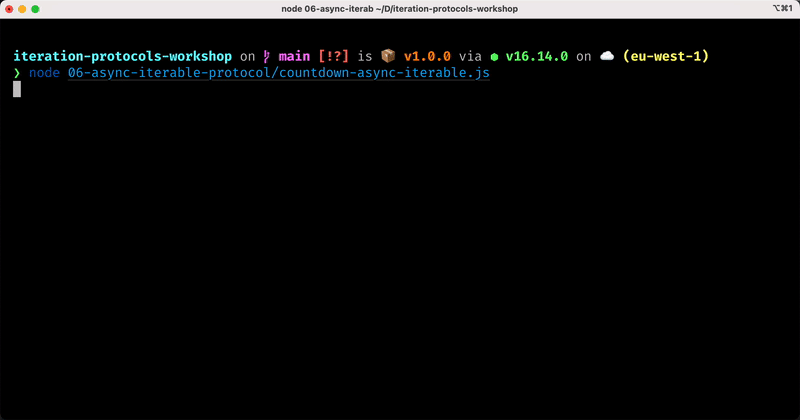

# 06 - Async Iterable Protocol

In the previous chapters we already mention that **async iterable** objects would allow us to do something like this:

```js
for await (const currentPage of somePaginatedDataset) {
  // process data from `currentPage`
}
```

Which is a very convenient way to implement an asynchronous iteration, like, for instance, going over a paginated dataset.

So, without further ado, let's see how we can create async iterables.


## The async iterable protocol

An object is an **async iterable** if it implements a special method called `Symbol.asyncIterator`, which is a zero-argument function that returns an **async iterator**.

Again this is very close to the definition of **iterable** objects that we discussed in [chapter 04](/04-iterable-protocol/README.md).

The following table summarises the differences between the 2 iterable protocols:

|             | **Iterable**      | **Async Iterable**     |
|-------------|-------------------|------------------------|
| **method**  | `Symbol.iterator` | `Symbol.asyncIterator` |
| **returns** | iterator          | async iterator         |

Let's take a moment to remember that an iterable is an object that holds or represents a collection. We can iterate over that collection by asking the iterable to give us an iterator. For synchronous iterables we need to call `Symbol.iterator` to get a synchronous iterator, while for asynchronous iterables we need to call `Symbol.asyncIterator` get an async iterator.

Makes sense, right? 🤗

OK... Now, let's see an example. Let's convert our asynchronous countdown example into an async iterable:

```js
// countdown-async-iterable.js
import { setTimeout } from 'timers/promises'

function createAsyncCountdown (start, delay = 1000) {
  let nextVal = start
  return {
    [Symbol.asyncIterator]: function () {
      return {
        async next () {
          await setTimeout(delay)
          if (nextVal < 0) {
            return { done: true }
          }
          return { done: false, value: nextVal-- }
        }
      }
    }
  }
}
```

This is very similar to the code we presented to implement an async countdown iterator.

The only difference now is that our factory function returns an iterable object. In fact, it has a `Symbol.asyncIterator` method and this method returns an async iterator. If we take a closer look at the code inside the `Symbol.asyncIterator` function, we can see that it is exactly the same code we already wrote for the async iterator example.

Because objects returned by `createAsyncCountdown` are async iterable, we can use the `for await ... of` syntax with them:

```js
const countdown = createAsyncCountdown(3)

for await (const value of countdown) {
  console.log(value)
}
```

The following image illustrates what we should see on our terminal when executing this code:



Can you see that it takes roughly one second for every number to appear?

Also, as with synchronous iterables, `for await ... of` gives us the convenience of not having to deal with `done` and `value`. We just get the value objects straight away inside our loop.

How convenient is that? 😉


## Async iterables with generators

TODO:


```js
import { setTimeout } from 'timers/promises'

async function * createAsyncCountdown (start, delay = 1000) {
  for (let i = start; i >= 0; i--) {
    await setTimeout(delay)
    yield i
  }
}
```


## Node.js Readable streams are async iterables

TODO:

```js
import { createReadStream } from 'fs'

const sourceStream = createReadStream('bigdata.csv')

let bytes = 0
for await (const chunk of sourceStream) {
  bytes += chunk.length
}

console.log(`bigdata.csv: ${bytes} bytes`)
```

But be careful if you are writing the data somewhere else... You might overload the destination if writing too fast (the infamous backpressure problem).

How do we handle backpressure when consuming streams as async iterables?

```js
import { createReadStream } from 'fs'
import { once } from 'events'

const sourceStream = createReadStream('bigdata.csv')
const destStream = new SlowTransform()

for await (const chunk of sourceStream) {
  const canContinue = destStream.write(chunk)
  if (!canContinue) {
    // backpressure, now we stop and we need to wait for drain
    await once(destStream, 'drain')
    // ok now it's safe to resume writing
  }
}
```

But if you are dealing with streaming pipelines it's probably easier to use [`pipeline()`](https://nodejs.org/api/stream.html#streampipelinesource-transforms-destination-callback).

```js
import { pipeline } from 'stream/promises'
import { createReadStream, createWriteStream } from 'fs'
import { createBrotliCompress } from 'zlib'

const sourceStream = createReadStream('bigdata.csv')
const compress = createBrotliCompress()
const destStream = createWriteStream('bigdata.csv.br')

await pipeline(
  sourceStream,
  compress,
  destStream
)
```

> ℹ️  If you want to learn more about Node.js streams, you can check out my [open source workshop about Node.js Streams](https://github.com/lmammino/streams-workshop).

TODO:


## Converting Node.js event emitters to Async Iterable

TODO:

```js
import { on } from 'events'
import glob from 'glob' // from npm

const matcher = glob('**/*.js')

for await (const [filePath] of on(matcher, 'match')) {
  console.log(filePath)
}
```

TODO:

But be careful because this code will never exit from the loop. The following code might now behave as you might expect:

```js
import { on } from 'events'
import glob from 'glob' // from npm

const matcher = glob('**/*.js')

for await (const [filePath] of on(matcher, 'match')) {
  console.log(filePath)
}

// ⚠️  DANGER, DANGER (high voltage ⚡️): We'll never get here!
console.log('ALL DONE! :)')
```

To handle termination of the loop correctly we would need to have a way to _signal_ that `match` events won't happen anymore.

We could do that as follows:

```js
import { on } from 'events'
import glob from 'glob'

const matcher = glob('**/*.js')
const ac = new global.AbortController()

matcher.once('end', () => ac.abort())

try {
  for await (const [filePath] of on(matcher, 'match', { signal: ac.signal })) {
    console.log(`./${filePath}`)
  }
} catch (err) {
  if (!ac.signal.aborted) {
    console.error(err)
    process.exit(1)
  }
  // we ignore the AbortError
}

console.log('NOW WE GETTING HERE! :)') // YAY! 😻
```

NOTE: If you know ahead of time how many events you need to process you can also use a `break` in the `for ... await` loop.


## Using async iterators to handle web requests

Can we use async iterators to handle web requests a-la-Deno? 🦕

```js
import { createServer } from 'http'
import { on } from 'events'

const server = createServer()
server.listen(8000)

for await (const [req, res] of on(server, 'request')) {
  res.end('hello dear friend')
}
```

EASY PEASY LEMON SQUEEZY! 🍋

But... wait, aren't we processing all requests in series, now? 😱

```js
import { createServer } from 'http'
import { on } from 'events'

const server = createServer()
server.listen(8000)

for await (const [req, res] of on(server, 'request')) {
  // ⚠️ ... AS LONG AS WE DON'T USE await HERE, WE ARE FINE!
}
```

You don't believe me, right? Ok, let's try this:

```js
import { createServer } from 'http'
import { on } from 'events'
import { setTimeout } from 'timers/promises'

const server = createServer()
server.listen(8000)

for await (const [req, res] of on(server, 'request')) {
  await setTimeout(1000)
  res.end('hello dear friend')
}
```

TODO: here show picture with autocannon performance and how we send 1 req/sec

Let's stick to the basics... 😅

```js
import { createServer } from 'http'
import { setTimeout } from 'timers/promises'

const server = createServer(async function (req, res) {
  await setTimeout(1000)
  res.end('hello dear friend')
})

server.listen(8000)
```


## Exercises

TODO:


## Summary

TODO:

Iterable protocols are a way to standardize iteration in JavaScript and Node.js
Async iterators are ergonomic tools for sequential asynchronous iteration
But don't use them for everything!
Consuming data from paginated APIs or reading messages from a queue are good examples!
Handling web requests or events from an emitter might not be the best use cases!

That's all for now, congratulations on finishing the sixt and last chapter! 🎉

Take a little break and get ready to do some additional [Exercises](/07-exercises/README.md).

---

| [⬅️ 05 - Async Iterator protocol](/05-async-iterator-protocol/README.md) | [🏠](/README.md)| [07 - Exercises ➡️](/07-exercises/README.md)|
|:--------------|:------:|------------------------------------------------:|